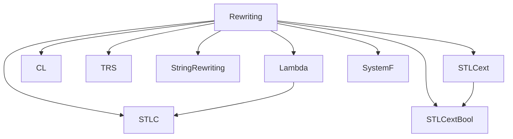

# Metatheory Architecture

This document summarizes the architecture of the `Metatheory` Lean 4 project after reviewing all tracked `.lean` files in the repository.

## 1) Two-tier architecture

Metatheory has two distinct layers:

### A. Core formalized modules (tightly coupled)

Core directories:

- `Metatheory/Rewriting`
- `Metatheory/Lambda`
- `Metatheory/CL`
- `Metatheory/TRS`
- `Metatheory/StringRewriting`
- `Metatheory/STLC`
- `Metatheory/STLCext`
- `Metatheory/STLCextBool`
- `Metatheory/SystemF`

Characteristics:

- Deep interdependencies across modules (especially through `Rewriting` and between typed/untyped calculi).
- Shared proof infrastructure (`Star`, `Confluent`, `Diamond`, termination, normal forms).
- Generic-to-specific proof reuse (e.g., proving a local property once, then lifting to confluence through generic theorems).
- Mathlib-facing interoperability via `Rewriting/Compat.lean` (mathlib-style naming), plus targeted Mathlib imports in advanced TRS components.

### B. Extended standalone modules (broad, mostly self-contained)

At `Metatheory/*.lean`, there are about ~70+ standalone modules (currently 78 files) covering topics like effects, macro systems, abstract interpretation, domain/game/category semantics, compilation, and advanced type disciplines.

Characteristics:

- Usually self-contained, with light or no imports.
- Repeated use of a lightweight **computational paths** style (`Step`/`Path`) rather than depending on the full generic rewriting stack.
- Local proof algebra built from path composition and symmetry (`trans`, `symm`) and context lifting (`congrArg`-style transport).

---

## 2) Core module dependency graph

Directory-level dependencies (cross-module):

```text
Rewriting      -> (foundation; no core dependency)
Lambda         -> Rewriting
CL             -> Rewriting
TRS            -> Rewriting
StringRewriting-> Rewriting
STLC           -> Lambda, Rewriting
STLCext        -> Rewriting
STLCextBool    -> STLCext, Rewriting
SystemF        -> Rewriting
```

Mermaid view:



Representative internal pipelines:

- **Lambda:** `Term → Beta → MultiStep → Parallel → Complete → Diamond → Confluence/Generic`
- **STLCext:** `Types/Terms/Reduction/Parallel/Complete → Confluence`
- **SystemF:** `Types/Terms/Typing → SubjectReduction + StrongReduction + StrongNormalization → Parallel/Complete/Diamond → Confluence`
- **TRS/StringRewriting:** `Syntax/Rules → local confluence + termination → Newman-based confluence`

---

## 3) Core types and relations

| Name | Location | Role |
|---|---|---|
| `Term` | `Lambda/Term.lean`, `CL/Syntax.lean`, `SystemF/Terms.lean`, `STLCext*/Terms.lean`, `TRS/FirstOrder/Syntax.lean` | Object language terms (de Bruijn in lambda/system F; first-order terms over signatures in TRS). |
| `Ty` | `STLC/Types.lean`, `STLCext/Types.lean`, `STLCextBool/Types.lean`, `SystemF/Types.lean` | Type grammars for each calculus. |
| `Subst` | `TRS/FirstOrder/Syntax.lean` (`Nat → Term sig`), `SystemF/StrongNormalization.lean` | Substitution models for first-order and higher-order developments. |
| `Signature` | `TRS/FirstOrder/Syntax.lean` | Function symbols + arity for first-order TRS. |
| `Rule` / `RuleSet` | `TRS/FirstOrder/Rules.lean` | Rewrite rules and rule predicates. |
| `HasType` | `STLC/Typing.lean`, `STLCext/Typing.lean`, `STLCextBool/Typing.lean`, `SystemF/Typing.lean` | Typing judgments. |
| `Step` | multiple modules | One-step reduction relation. |
| `ParRed` | `Lambda/Parallel.lean`, `CL/Parallel.lean`, `STLCext/Parallel.lean`, `STLCextBool/Parallel.lean`, `SystemF/Parallel.lean` | Parallel reduction for diamond-style confluence proofs. |
| `Star`, `Plus`, `Joinable`, `Diamond`, `Confluent`, `Terminating` | `Rewriting/Basic.lean` | Generic ARS closure/confluence/termination framework. |

---

## 4) Key theorems across the project

### Generic rewriting framework

- `Rewriting.confluent_of_diamond` (`Rewriting/Diamond.lean`)
- `Rewriting.confluent_of_terminating_localConfluent` (`Rewriting/Newman.lean`)
- `Rewriting.confluent_union` (Hindley-Rosen, `Rewriting/HindleyRosen.lean`)
- Normal-form uniqueness/existence results in `Rewriting/Basic.lean`

### Lambda calculus / CL

- `Lambda.confluence` (Church-Rosser, `Lambda/Confluence.lean`)
- `Lambda.parRed_diamond` (`Lambda/Generic.lean`)
- `CL.parRed_diamond`, `CL.confluent`, `CL.church_rosser` (`CL/Confluence.lean`)

### TRS / String rewriting

- `TRS.local_confluent`, `TRS.step_terminating`, TRS confluence via Newman (`TRS/Confluence.lean`)
- `StringRewriting.local_confluent`, `StringRewriting.step_terminating`, and confluence (`StringRewriting/Confluence.lean`)

### STLC / extended STLC / booleans / System F

- `STLC.subject_reduction`, `STLC.strong_normalization`
- `STLCext.subject_reduction`, `STLCext.strong_normalization`, `STLCext.confluence`
- `STLCextBool.subject_reduction`, `STLCextBool.strong_normalization`, `STLCextBool.confluence`
- `SystemF.subject_reduction`, `SystemF.strong_normalization`, `SystemF.confluence`

---

## 5) Computational paths pattern in standalone modules

Many standalone modules use a recurring lightweight proof kernel:

```lean
inductive Step (α : Type) : α → α → Type
inductive Path (α : Type) : α → α → Type
def Path.trans : Path α a b → Path α b c → Path α a c
def Path.symm : Path α a b → Path α b a
def Path.congrArg ...
```

Interpretation:

- `Step`: named atomic rewrite/equational moves.
- `Path`: explicit proof object for multi-step chains.
- `trans`: composition of chains (path concatenation).
- `symm`: reversible reasoning.
- `congrArg` (and variants): lift paths through context/formers.

This functions as a local, domain-specific rewriting/equality framework without requiring the full generic ARS stack in each standalone file.

---

## 6) Design decisions

### De Bruijn indices

- Used in `Lambda`, `STLC`-adjacent term layers, and `SystemF`.
- Avoids alpha-conversion bureaucracy and gives direct structural recursion for substitution/shift lemmas.

### Parallel reduction for confluence

- Core confluence strategy in `Lambda`, `CL`, `STLCext`, `STLCextBool`, and `SystemF`.
- Standard pipeline: define `ParRed` + `complete` development, prove diamond, then apply generic `confluent_of_diamond`.

### Tait/logical-relations method for strong normalization

- Used in `STLC/Normalization.lean`, `STLCext/Normalization.lean`, and `SystemF/StrongNormalization.lean`.
- Main shape: reducibility candidates / reducibility predicate / fundamental lemma / SN corollary.

---

## 7) Future work and currently parked pieces

### TRS FirstOrder case-study modules are intentionally parked

The following files contain TODO comment blocks around substantial proof/code regions tied to missing dependency alignment (e.g., `Fin.cons`, `List.Shortlex`, related Mathlib APIs):

- `TRS/FirstOrder/GroupTheory.lean`
- `TRS/FirstOrder/BooleanCaseStudy.lean`
- `TRS/FirstOrder/DependencyPairs.lean`

Related TODO marker:

- `TRS/FirstOrder/Examples.lean` includes a restoration note for `Ordering/DependencyPairs`.

### STLCext confluence is already present

`Metatheory/STLCext/Confluence.lean` exists and proves confluence (Church-Rosser form) using the same parallel-reduction + diamond architecture as other core calculi.

